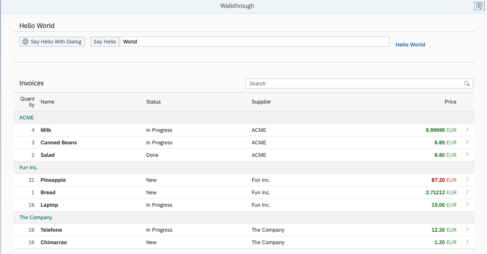

# SAPUI5 Walkthrough

This repo follows the following tutorial: [SAPUI5 Walkthrough](https://sapui5.hana.ondemand.com/#/topic/3da5f4be63264db99f2e5b04c5e853db)

## Configuration

* Follow this tutorial: [Getting Started])(https://sap.github.io/ui5-tooling/pages/GettingStarted/)

* If you have some issue regarding `manifest.json` when executing `ui5 use openui5@latest`, check this [link](https://github.com/SAP/openui5/issues/3306https://github.com/SAP/openui5/issues/3306)

## How to run

* `npm run start` or `ui5 serve -o index.html`

## Output

